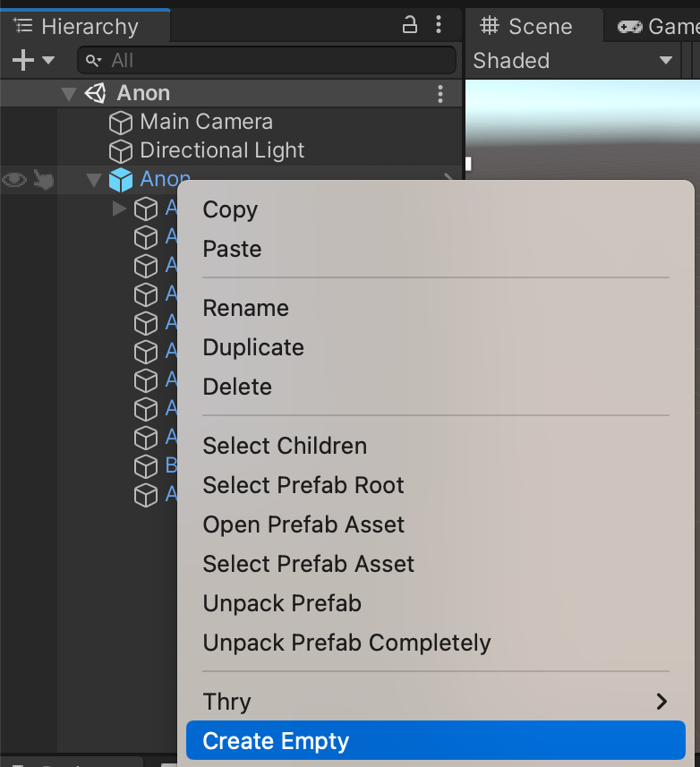
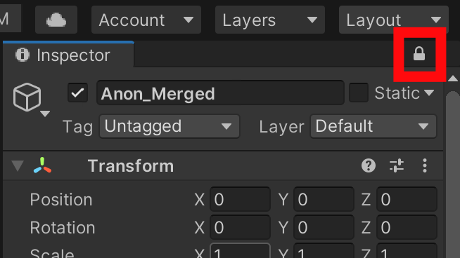

基本的な使い方
===

メッシュを結合してMesh Renderersを減らす {#merge-skinned-mesh}
--

Avatar Optimizerを使用すると簡単にSkinned Meshを結合することができます！



**なせSkinned Meshを結合するの？**

SkinnedMeshを結合するとメッシュを変形させる処理の回数が減るため軽くなります。
また、MergeSkinnedMeshで結合すると同じマテリアルのマテリアルスロットを結合できるので、描画処理の回数も減らす事ができます



今回はまず初めに一番単純なパターンとしてAnonちゃんを軽量化します

まず初めにマージ先のGameObjectを作りましょう。
アバターのGameObjectを右クリックから `Create Empty` をクリックして新たなGameObjectを作ります。
そしたらわかりやすい名前に変えておいてください。この記事では`MergedMesh`とします

そしたら`Merged Mesh`に`Merge Skinned Mesh`を追加しましょう。

すると`Merge Skinned Mesh`と`Skinned Mesh Renderer`が追加されます。

この`Merge Skinned Mesh`コンポーネントは、指定された`Skinned Mesh Renderer`を一緒についている`Skinned Mesh Renderer`にマージするコンポーネントです。
マージを機能させるために`Merge Skinned Mesh`にマージする`Skinned Mesh Renderer`を指定しましょう。

指定を楽にするために、`MergedMesh`を選択した状態でinspectorをロックしましょう。
こうすることで複数のS`Skinned Mesh Renderer`をまとめてドラックアンドドロップできるようになります。[^tip-lock-inspector]

それではHierarchyで顔のメッシュであるBody以外の`Skinned Mesh Renderer`を選択してどロックバンドドロップでSkinned Renderersに指定しましょう！



**なせ顔のメッシュを結合しないの？**

BlendShapeは頂点数とBlendShape数の積に比例して重くなる処理です。
そのため、BlendShapeの数が多い顔のメッシュを頂点数の多い体のメッシュと結合するとかえって重くなってしまうため、顔は別のままにするのを推奨しています



[^tip-lock-inspector]: PhysBoneに複数のコライダーを指定するのにも使えたり、色んなところで使えるので覚えておくと便利だと思います。
