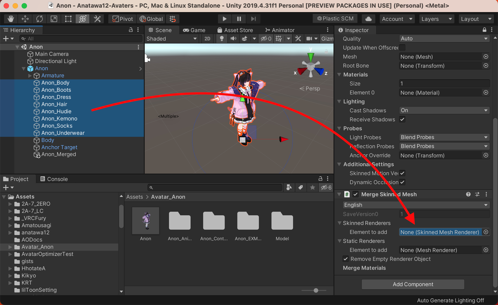

Basic Usage
===

Merge Meshes to reduce # of Skinned Renderers {#merge-skinned-mesh}
--

You can easily merge Skinned Mesh with Avatar Optimizer!



**Why will we merge Skinned Mesh?**

Merging Skinned Mesh will reduce number of deforming mesh (skinning).
Also, Merging with MergeSkinnedMesh can reduce material slots so we can reduce number of drawing. 



This time, I'll optimize Anon-chan as a simplest case.

First, create GameObject for merged mesh.
Right-click avatar GameObject and click `Create Empty` to create new GameObject.
Then, rename to understandable name. In this document, I call it as `Anon_Merged`.

Then, Add `Merge Skinned Mesh` to `Anon_Merged`.

This adds `Merge Skinned Mesh` and `Skinned Mesh Renderer`.

The `Merge Skinned Mesh` will merge specified meshes[^mesh] into the attached mesh. 
To make merge working, let's specify meshes to be merged onto `Merge Skinned Mesh`!

To make it easy to specifying meshes, lock the inspector with `Anon_Merged` selected. 
This allow us to drag & drop multiple meshes at once.[^tip-lock-inspector]

Then, select meshes except for Body, which is the face mesh, and drag & drop to Skinned Renderers!



**Why don't we merge face meshes?**

BlendShape (Shape Keys)[^blend-shape] is a feature became heavier in proportion to the count of vertices and BlendShapes.
Therefore, merging face mesh, which has many BlendShapes, and body mesh, which has many vertices, can make your avatar heavier than before
so I recommend not to merge face mesh.



Next, configure `Anon_Merged`!

Because of many reasons[^merge-skinned-mesh], `Merge Skinned Mesh` doesn't configure anything except of bones, meshes, and materials.
So, please configure Bounds, Root Bone, Anchor Override and else yourself.
I think specifying Anchor Override of your body and setting Hips as the Root Bone will work well.



### Checking performance rank without uploading avatar {#performance-rank-without-upload}

Because Avatar Optimizer is a non-destructive avatar modification tool,
Performance Rank on the VRCSDK Control Panel is no loner be relied upon.

Instead, you can check Performance Rank in Play Mode with Actual Performance Window of anatawa12's Gist Pack.
Please check [basic usages of anatawa12's Gist Pack][gists-basic-usage] and [documentation of Actual Performance Window][Actual Performance Window] for more details。

[gists-basic-usage]: https://vpm.anatawa12.com/gists/ja/docs/basic-usage/
[Actual Performance Window]: https://vpm.anatawa12.com/gists/ja/docs/reference/actual-performance-window/



[^tip-lock-inspector]: It is useful to keep in mind that it can be used in many other places such as specifying multiple colliders for PhysBone.
[^merge-skinned-mesh]: It's planned to support specifying Bounds, and Root Bone and Anchor Override are impossible to merge so it's not planned. If you know any good algorithm, please tel me that.
[^mesh]: In this document mesh means SkinnedMeshRenderer, not the Mesh asset in Unity.

Freezing BlendShape {#freeze-blendshape}
---

In addition, you can easily freeze BlendShape(Shape Keys)[^blend-shape] with Avatar Optimizer!



**Why do we freeze BlendShapes?**

As I described before, BlendShape (Shape Keys)[^blend-shape] is a feature became heavier in proportion to the count of vertices and BlendShapes.
Also, BlendShape has performance impact just by existing, regardless of its weight.
So, freezing BlendShapes make your model lighter even if it's not reflected in Performance Rank.
It's better for the merged mesh not to have any BlendShapes if possible.



Now let's freeze the BlendShapes for the unused body and clothing body shape changes!

First, add `Freeze BlendShapes` to `Anon_Merged`, which is the mesh increased vertex count.

`Freeze BlendShape` freezes the BlendShape of the attached mesh.

To make it working freezing, 

To make the merge work, specify the BlendShape to be frozen!

If the checkbox is checked, the BlendShape will be frozen.

This completes the settings for freezing BlendShape!

[^blend-shape]: BlendShape is the name of Shape Keys in Unity. Unity and Maya call them as Blend Shape, Blender calls them as Shape Key, Metasequoia and MMD call them as Morph.
